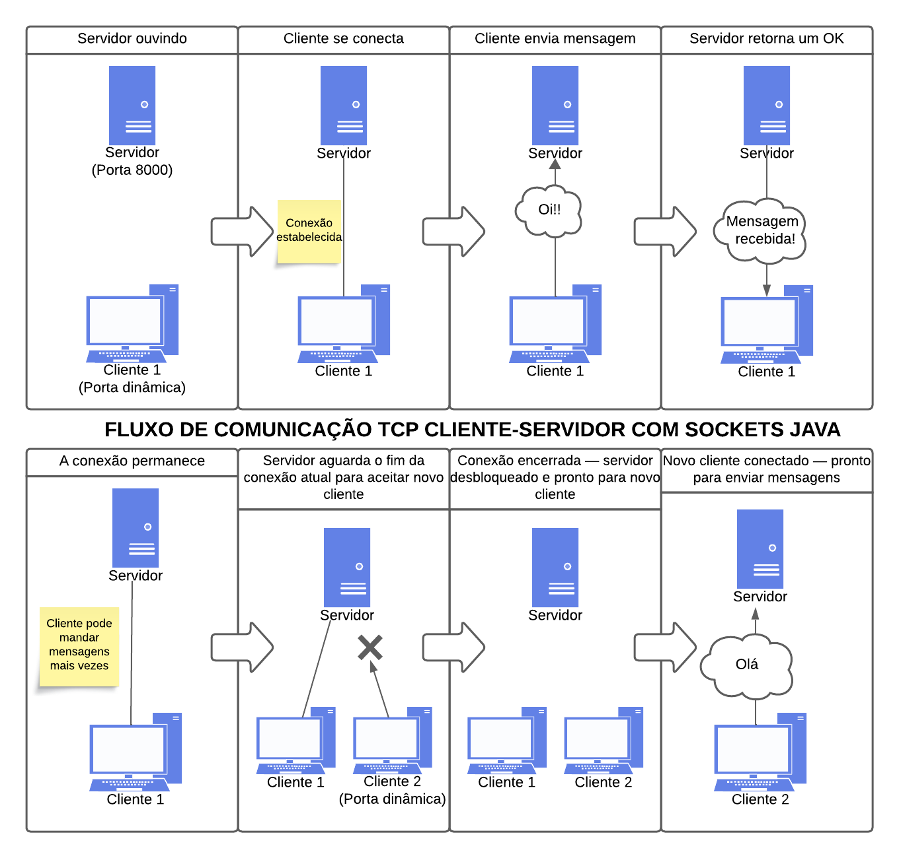

# 📡 Java TCP Socket Communication

Este projeto em Java implementa uma comunicação baseada no protocolo TCP utilizando **sockets**, com o objetivo de trazer a camada de transporte para fora da abstração normalmente fornecida pelas bibliotecas de alto nível.

## 🎯 Objetivo

Este projeto foi desenvolvido como parte da disciplina de **Redes de Computadores e Serviços**, do curso de **Tecnologia em Análise e Desenvolvimento de Sistemas**, sob orientação do professor **Luiz Carlos Efigênio**.  
Seu propósito é proporcionar uma compreensão prática do funcionamento da camada de transporte, especificamente com o uso de **sockets TCP**.

## 🧩 Estrutura do Projeto

A aplicação é composta por dois programas principais:

### 🖥️ Servidor (`Server`)

- Inicializa uma `ServerSocket` na porta **8000**.
- Aguarda conexões de clientes utilizando o método `accept()`.
- Ao conectar, identifica o IP e a porta do cliente.
- Cria um laço de repetição onde:
    - Recebe mensagens enviadas pelo cliente com `readUTF()`.
    - Exibe as mensagens no console.
    - Retorna uma confirmação usando `writeUTF()`.
- Em caso de desconexão do cliente, trata a exceção e volta a aguardar por novas conexões.

### 💬 Cliente (`Client`)

- Cria um `Socket` e conecta-se ao servidor usando IP (`127.0.0.1`) e porta (`8000`).
- Solicita que o usuário digite mensagens via terminal.
- Envia as mensagens ao servidor utilizando `writeUTF()`.
- Aguarda e exibe a confirmação de recebimento com `readUTF()`.

## 🗂️ Fluxo do Funcionamento

Abaixo está o fluxo de funcionamento do sistema Cliente-Servidor desenvolvido:

## 🔧 Tecnologias Utilizadas

- Java
- Comunicação por `Socket`, `ServerSocket`
- Manipulação de dados com `DataInputStream` e `DataOutputStream`

## 📌 Observações

- O servidor deve ser iniciado antes do cliente, pois ele é o ponto de escuta para as conexões.
- A comunicação é simples, ponto-a-ponto, para fins exclusivamente educacionais.
